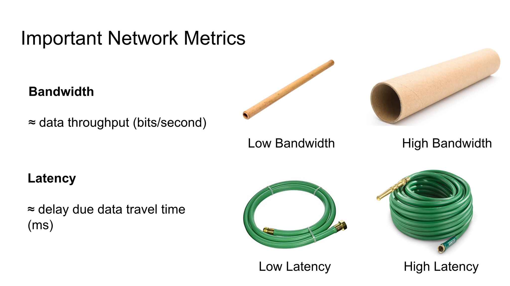

### Idealized Uniprocessor Model
一个"真空中的球形处理器"应该能完成什么功能?

- 定义**变量**:整数,浮点数,指针等
- 对变量进行**运算**:算术,逻辑运算等
- 控制操作**顺序和逻辑**:分支逻辑,循环等

理想的处理器只在运算这一步有cost,读写都是免费的.

processor的时间的处理时间量级大概在1ns,而memory的读写时间量级却在100ns.

### Compilers and assembly code
如C/C++和Fortran的编译器检查程序是否合法,然后将其翻译(并优化)为汇编代码.

### Mor Realistic Uniprocessor Model

内存读取的cost有两部分

- 读取会写入一个字符(不妨记延迟为$\alpha$秒)
- 存储信息的传输带宽限制(不妨记为$\beta^{-1}$ byte/sec)
则读取并传输$n$ byte信息的时间为$\alpha+n\beta$.

